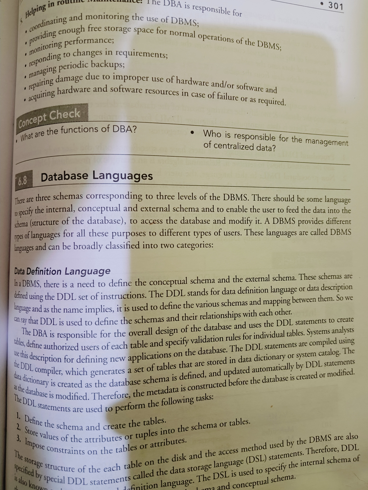

# Image Processing with OpenCV

## Overview

This project demonstrates basic image processing techniques using OpenCV, a powerful library for computer vision tasks. The code provided reads an image, converts it to grayscale, resizes it, applies binary thresholding, and performs adaptive thresholding. The results are displayed in separate windows for comparison.

## Features

- **Grayscale Conversion**: Converts a color image to grayscale for easier processing.
- **Image Resizing**: Resizes the image to a standard dimension (450x450 pixels).
- **Binary Thresholding**: Applies a simple threshold to create a binary image.
- **Adaptive Thresholding**: Uses adaptive methods to handle varying lighting conditions in the image.

## Prerequisites

To run this project, you need to have Python and OpenCV installed. You can install OpenCV using pip:
pip install opencv

## Code Analysis

1. **Image Loading**: The `cv2.imread` function reads an image from the specified file path. Ensure that "02.jpg" is in the same directory as your script or provide an absolute path.

2. **Grayscale Conversion**: The `cv2.cvtColor` function converts the loaded color image to grayscale. This is essential for many image processing tasks as it simplifies the data.

3. **Resizing**: The `cv2.resize` function standardizes the image size to 450x450 pixels, which is useful for consistent processing and display.

4. **Thresholding**:
   - **Binary Thresholding**: The `cv2.threshold` function creates a binary image where all pixel values above a certain threshold (127) are set to white (255), and all others are set to black (0).
   - **Adaptive Thresholding**: The `cv2.adaptiveThreshold` function applies a different threshold value for different regions of the image based on local pixel values. This is particularly useful in images with varying illumination.

5. **Displaying Results**: The `cv2.imshow` function displays the original grayscale image, the binary thresholded image, and the adaptive thresholded image in separate windows.

6. **Cleanup**: Finally, `cv2.waitKey(0)` waits for any key press before closing all windows with `cv2.destroyAllWindows()`.

## Usage

1. Place your target image named "02.jpg" in the same directory as your script.
2. Run the script using Python.
3. Observe the results displayed in separate windows.

## Results

### Original Image

### Adaptive Thresholded Image

## Conclusion

This project serves as an introduction to basic image processing techniques using OpenCV. You can extend this project by experimenting with different images or applying additional processing techniques such as edge detection or contour finding.

For any questions or contributions, feel free to open an issue or submit a pull request!
